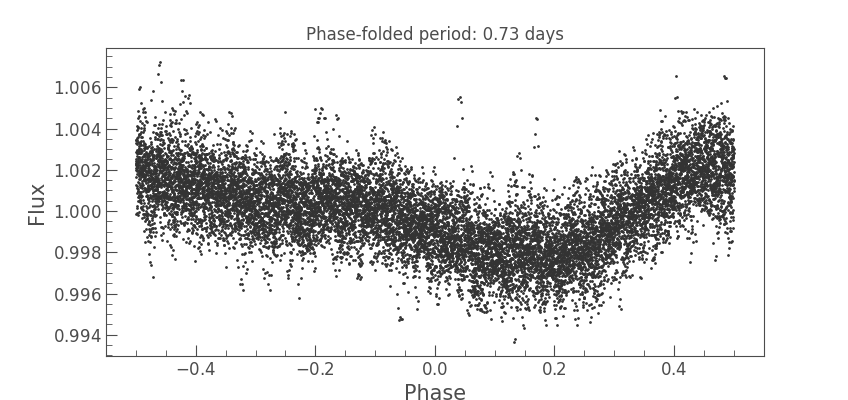

# Summary

The exoplanets detection is a field that has been growing exponentially in the last decades. More than
half of the known exoplanets have been discovered thanks to the usage of the transits method. It consists
on the measurement of the stellar light flux drops caused by a planet passing through the visual line
between the star and the observer. So far, several space-based missions have already been launched
as COROT [@baglin:2006], Kepler [@borucki:2010] and TESS [@ricker:2015], producing huge amounts of publicly available data and growing communities
of scientists looking forward to them. Every star observation shows its own systematics, together
with the common ones, due to its own characteristics and its nearby sky field. Therefore,
it has been a common task for scientists to create exoplanet transiting models for each analyzed star
and try their search tools on them to find their detection limits. Typically, the astronomer has to compile
several tools and put them together in order to retrieve the desired data, clean it, generate the models, inject
them into the data and then perform the recovery process. We present a new software package that provides 
a smooth integration of all these stages and an extension to the typical model injection and recovery 
scenarios by adding a new dimension to the analysis, establishing more confident 
detection thresholds in most of the cases.

# 1. MATRIX
The main data product that astronomers use to analyze and search for transiting exoplanets are the light
curves. These are time series for stellar flux measurements. One of the main methods used to search 
transiting exoplanets under light curves in the community is the Box Least Squares algorithm [@kovacs:2016]. 
This method folds the light curve with many different periods and tries to fit a squared model of a transit
to each of the folded time series. The folded signal with less residuals is chosen as the best candidate
to a transiting exoplanet and its main parameters (period, depth, epoch, duration) are returned. In the last
two years, a new method appeared named Transit Least Squares [@hippke:2019], aimed to challenge the ``BLS`` results and providing
better residuals thanks to the usage of realistic transit models for its fit stages instead of a squared one.
``MATRIX`` will use ``TLS`` by default, though the user could switch to ``BLS`` if desired.

The user will provide a grid of periods by selecting the `MAX_PERIOD`, `MIN_PERIOD` and `STEP_PERIOD`, a grid
of planet radius by selecting `MAX_RADIUS`, `MIN_RADIUS` and `STEP_RADIUS` and the number of epochs to be explored
for each case. ``MATRIX`` will initially download the target star light curve (or load a `csv` file specified by the 
user), generate a model of transit thanks to the usage of `ellc` [@maxted:2016], injecting it into the original data and 
store the resultant modeled light curve in a `csv` file for each case. That is, `MATRIX` will store a set of 
`PERIOD_GRID_SIZE` x `RADIUS_GRID_SIZE` x `EPOCHS_COUNT` files for the recovery scenario.

In the recovery stage, `MATRIX` will load each of the transit-injected light curves and will perform a user-defined
trend normalization using `wotan` [@wotan:2019]. Afterwards, the injected transits will be searched by using `TLS`. 
In case a transit signal has been found to match the injected one with the same period or a period matching the
first three subharmonics or harmonics (with an error tolerance of 1 hour) and epoch (also with an error tolerance of 1 hour) 

The tool has successfully been used in professional first-level scientific research to assess the detectability
of possible transiting exoplanets around Hot-Subdwarfs [@vangrootel:2021].

# 2. Scientific cases 

The ``MATRIX ToolKit`` is specially designed to help the scientists develop a robust injection and recovery 
analysis on a given target star. This is needed in almost every exploration project that aims to define
the strength of its search tools and pipelines. As a result, a table with numeric results and a default plot
will be generated as by-products at the end of the execution.

## Single-phase inject and recovery
The most usual way to study the ability of a given exoplanet search tool of finding new candidates is the
launch of an injection and recovery process for a grid of periods and planet radius. For this traditional case, 
MATRIX provides an easy-to-use execution command which only needs to be fed with a YAML file including the 
scenario parameters 
(see [mono-phase.yaml](https://github.com/martindevora/matrix/blob/master/examples/mono-phase.yaml) file.). You
can appreciate that the `PHASES` property is set to `1`.

## Multi-phase inject and recovery
In many cases, a single-phase injection and recovery scenario proves to show poor results near the threshold
detection limit (when transiting exoplanet models start to be difficult to be detected) because it only assess
the detectability of a model with one sample for a given period and radius pair. But there is also one more 
reason that could reverse completely the results of a single-phase inject and recovery scenario: the epoch
of the modeled transiting exoplanets becomes crucial. In case the selected epoch makes the transit events 
appear under noisy regions or data gaps, they will become much more difficult to detect. This situation is very complicated
to correct and therefore, we have added a new dimension to the inject and recovery scenarios: a grid of epochs
for each period and radius cell. By setting the `PHASES` parameter to any value greater than `1` we will be running
an injection and recovery analysis on as many different epochs for each period and radius within the grid as phases
we determined.

# 3. Supported inputs for targets and tools
We have included several kind of inputs for `MATRIX`. Missions like TESS provide short and long cadence data and their study
differ in several points. Thus, the injection and recovery task might be useful for each of them separately. Sometimes the
astronomer will be provided with a file containing the target light curve and sometimes the astronomer might be
interested in specifying the target star properties manually instead of loading those from the online catalogues. Finally,
the scientist could not only want to use the `MATRIX` built-in search method but also use his cleaning and search
algorithms to execute an injection and recovery process according to his real search procedures instead of using the
ones we adopted as default. We explain some additions we included in our new tool to support all of these possibilities.

## Missions and exposure times
Support for Kepler, K2 and TESS missions online data is included. By only specifying the field `TARGET` with the appropiate
target name (e.g. KIC 1234, EPIC 1234 or TIC 1234 for Kepler, K2 or TESS targets). By default, the short cadence exposure time
will be selected (60 seconds for Kepler and K2, 120 seconds for TESS) but it can be switched to the long cadence by changing
the value of the `EXPOSURE_TIME` parameter (long cadence values are 1800 seconds for the three missions).

## Star properties
The target star properties can be loaded automatically either from the online catalogues when the `TARGET` name is specified or
providing a `STAR_INFO` root property containing child properties for each star property like mass, radius, etc.

## File input
In addition to setting the target to be searched for, a `FILE` parameter can be provisioned pointing to the absolute file path
to be loaded in `csv` format. This way, the star properties will be downloaded from the online catalogues and the light curve
used to inject the models will be loaded from disk. If no `TARGET` value is provided, the `STAR_INFO` property needs
to be included in order to be able to generate a realistic model according to the expected host star.

## Grids configuration
Both the period and radius grids can be generated linearly or logarithmically (by setting `PERIOD_GRID_GEOM` or `RADIUS_GRID_GEOM`
to `linear` or `log`) In case `linear` is selected, the grid will be generated by sampling periods or radiuses equally spaced given
`PERIOD_STEP` or `RADIUS_STEP` respectively. In case `log` is selected, `PERIOD_STEP` or `RADIUS_STEP` will define the number of
points to be hold by the respective grid.

## Rotation signal clean-up
Among every kind of star that we can find, a typical case is a fast-rotator. This stars show a light curve with one or more
remarkable sinusoidal trends with a period from a few hours to several days, as shown in \autoref{fig:autodetrend}. In order to search for transit signals within these
light curves, the astronomer usually needs to use some cleaning technique on them. Therefore, MATRIX adds an optional cleaning
stage where the scientist can define three parameters: type of algorithm (`DETREND_PERIOD_METHOD` property) and size of the cleaning
window (`DETREND_PERIOD` property).

{width=80%}

## Custom algorithms
Maybe the cleaning and search processes implemented in `MATRIX` could not be enough for the astronomer purposes. Therefore, we have
added the option to override them through the properties. If the scientist wanted to use a different cleaning algorithm and a 
different search one, he would just need to create new implementations of MatrixCleaningAlgorithm and MatrixSearchAlgorithm 
classes provided by `MATRIX` and then pass them to the constructor (if running via code) or to the `CUSTOM_CLEAN_ALGORITHM`
and `CUSTOM_SEARCH_ALGORITM` properties respectively (if running through the main entrypoint).

# 4. Performance
As mentioned before, the multi-phase injection and recovery scenarios help us to better characterize the detection
limits by giving a new dimension to the found thresholds. That is, we can determine that the borders are not hard.
Instead, we prove that they are variable and might depend on different diverse systematics of each target star.
As an example, we can appreciate that the \autoref{fig:multi}, where we used 4 different epochs, defines
much better the detection thresholds and establishes soft limits where the detectability might depend on some 
conditions or systematics. In comparison with \autoref{fig:mono}, we can see that for a one-phase analysis those
kind of scenarios are ignored and a hard border is defined (either a planet with a given radius and orbital period
is marked as detectable or not). 

{width=80%}

{width=80%}

# 5. Future implementations  

As we are using squared grids and the inject and recovery scenarios focus
on finding a detection threshold, some wide regions are usually showing the same detection values (found or
not found), which might represent a waste of computational power. To mitigate this, we plan to incorporate some
kind of attention mechanism into our algorithm in such a way that it could only keep testing the scenario only
near the detection limits, assuming that above them the results are true (found) and below them they are 
false (not found).

We will also probably study other software tools capable of generating transit models that could improve the
performance of the inject phase, maybe replacing `ellc` by `PyTransit` [@parvianen:2015], which under our several
preliminary tests seemed to run faster.

# Acknowledgements
We acknowledge support from the Spanish Ministry of Science through the project PID2019-107061GB-C64/SRA (State Research Agency/10.13039/501100011033)

# References
