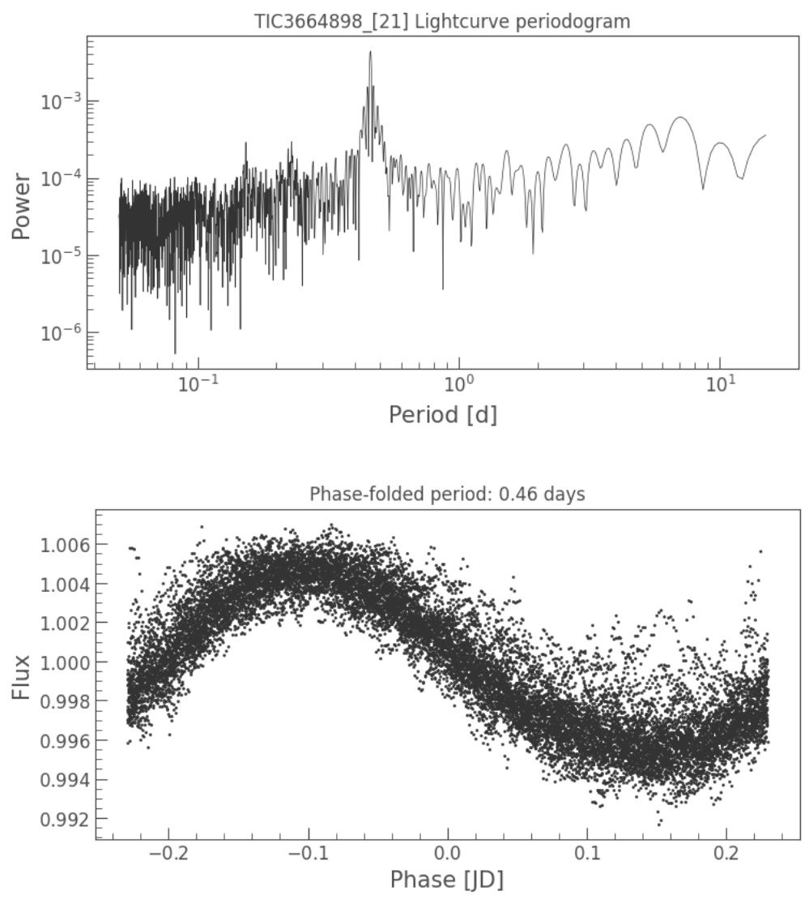

# Summary

Exoplanets detection is a field that has been growing exponentially over the past three decades. Approximately three-quarters of all known exoplanets have been discovered thanks to the transit method, which consists of measuring the stellar flux decrease caused by a planet passing through the line-of-sight between the star and the observer. Several space-based missions have already been launched to search for planets with the transit method, such as COROT [@baglin:2006], Kepler [@borucki:2010] and TESS [@ricker:2015]. These missions have produced huge amounts of publicly available data, that scientists scrutinize in attempts to detect the existence of new exoplanets. However, equally important is to know the limitations of a given data set. Indeed, once a data set has been explored in the search for exoplanets, one needs to understand what the detection limits are before ruling out the presence of exoplanets, or extra exoplanets in cases where one or more are discovered. That is, precisely determining the photometric precision of the data set to establish which planets might exist and transit, but remain yet undetected. In this context, injection-and-recovery tests are a direct method that can establish detection limits of a given data set, an approach that has been used often in the literature [e.g., @eisner:2020]. This method consists of generating synthetic planets within a radius-period grid, injecting them directly into a data set, and attempting to recover them with a transit-search algorithm. However, typically, astronomers need to employ several independent tools to retrieve the desired data, clean them, generate the models, inject them into the data and then perform the recovery process. 
In this article we present the user-friendly python package ``MATRIX``, which also uses the ``lcbuilder`` package that we also developed for this work. ``MATRIX`` provides a smooth integration of all the mentioned scientific stages and an extension to the typical injection-and-recovery test model by including the phase of the planet as a new dimension; that is, the synthetic planets generated have three free parameters: radius, period and epoch. This strategy establishes more confident detection thresholds by increasing the statistical sample examined by each pair of radius and period parameters.

# 1. MATRIX
The main data that astronomers use to analyse and search for transiting exoplanets are light curves, which are time series of stellar flux measurements. One of the main methods used to search for transiting exoplanets in light curves is the Box-fitting Least Squares algorithm (``BLS``) [@kovacs:2016]. 
This method folds the light curve with many different periods and tries to fit a squared model of a transit to each of the folded time series. The folded signal with the fewest residuals is chosen as the best candidate to a transiting exoplanet and its main parameters (period, depth, epoch and duration) are returned. In the last two years a new method appeared named Transit Least Squares (``TLS``) [@hippke:2019], aimed at challenging ``BLS`` results and providing better residuals thanks to the use of realistic transit models for its fitting stages instead of a squared one.
``MATRIX`` uses a slightly modified version of ``TLS`` by default, although the user may switch to ``BLS`` if desired. 

The user should provide a grid of periods by selecting the values of `MAX_PERIOD`, `MIN_PERIOD` and `STEP_PERIOD`, a grid of planet radii by specifying `MAX_RADIUS`, `MIN_RADIUS` and `STEP_RADIUS`, and the number of epochs to be explored for each case. ``MATRIX`` will initially download the target star's light curve or load a `csv` file specified by the user by using ``lcbuilder``, the sibling package of ``MATRIX``, so that we rely the data sources capabilities to a generic package that could also be reused by other projects depending on light curves in the future. Afterwards, a transit model will be generated thanks to the use of `ellc` [@maxted:2016], injecting it into the original data and store the resultant modelled light curve in a `csv` file for each case. That is, `MATRIX` will store a set of `PERIOD_GRID_SIZE` x `RADIUS_GRID_SIZE` x `EPOCHS_COUNT` files for the recovery scenario.

In the recovery stage, `MATRIX` will load each of the transit-injected light curves and perform a user-defined trend normalization using `wotan` [@wotan:2019]. Afterwards, the injected transits will be searched using `TLS`. A recovered planet is defined when a transit signal is found to match the injected one with the same period (or a period matching any of the first three sub-harmonics or harmonics) and epoch, and where both the period and epoch have an error tolerance of one hour. The algorithm will search for the injected signal up to five runs (event though this value can be customized); that is, after a run, if the signal found is not the injected one, it will be masked and the signal search will be repeated. After five negative runs, the injected signal will be labelled as non-recovered.       

The original algorithm, without the multi-phase approach, was used for first time by @pozuelos:2020 and @demory:2020. Its new improved version, now called `MATRIX`, has successfully been tested by @vangrootel:2021.

# 2. Scientific cases 

The `MATRIX ToolKit` has been specially designed to establish detection limits of photometry data sets by performing robust injection-and-recovery analyses. This is needed for each discovery paper, where a data set is explored in the search for transiting planets, thereby allowing the authors to confidently rule out certain kind of planets and establish if any planets might be still hidden in the system.   
As a result of its execution, `MATRIX` generates a table with numerical results and a default plot where for each pair of radius and period a percentage of recovery is given by a colour code, where larger recovery rates are presented in yellow and green colours and lower recovery rates are shown in blue and darker hues.

## Single-phase injection-and-recovery
The most usual way to study the ability of a given exoplanet search tool to find new candidates is the launch of injection-and-recovery process for a grid of periods and planet radii. For this traditional case, `MATRIX` provides an easy-to-use execution command which only needs to be fed with a YAML file that includes the 
scenario parameters where the `PHASES` property is set to `1`.

## Multi-phase injection-and-recovery
In many cases, a single-phase injection and recovery scenario may yield poor results near the threshold detection limit (i.e., when the detection of the considered transiting exoplanet models starts to be difficult) because the algorithm only assess the detectability of a model with one sample for a given period and radius pair. In addition, there is also another reason that could completely reverse the results of a single-phase inject and recovery scenario: the epoch of the modelled transiting exoplanets becomes crucial. If the selected epoch makes the transit events appear under noisy regions or data gaps, they will become much more difficult to detect. This situation is very complicated to correct and, therefore, we have added a new dimension to the injection-and-recovery scenarios: a grid of epochs for each period and radius cell. By setting the `PHASES` parameter to any integer value greater than `1`, an injection-and-recovery analysis will be executed on as many different epochs for each period and radius within the grid as the number of phases that were determined.

# 3. Supported inputs for the targets and tools
Several kind of inputs for `MATRIX` are included. Missions like TESS and Kepler provide short- and long-cadence data, the user can choose which one wants to use. Sometimes the astronomer will be provided with a file containing the target's light curve, while other times the astronomer might be interested in specifying the target star's properties manually instead of loading those from the online catalogues. Finally, the scientist may not only just want to use `MATRIX` built-in search method, but also use their own cleaning and search algorithms to execute an injection-and-recovery process according to their real specific search procedures instead of using default options. In the following, some additions included in our new tool to support all of these possibilities are described in detail.

## Missions and exposure times
Support for online data obtained by the Kepler, K2 and TESS missions is included. The user may specify the field `TARGET` with the appropriate target name (e.g. KIC 1234, EPIC 2345 or TIC 3456 respectively for Kepler, K2 or TESS targets, respectively). By default, the short cadence exposure time will be selected (60 seconds for Kepler and K2, 120 seconds for TESS) but it can be switched to the long cadence by changing the value of the `EXPOSURE_TIME` parameter (long cadence values are 1800 seconds for the three missions).

## Target star’s properties
The target star’s properties can be loaded automatically either from online catalogues when the `TARGET` name is specified or by providing the `STAR_INFO` root property, which contains child values for each star parameter like mass, radius, etc.

## File input
In addition to setting the target to be searched, a `FILE` parameter can be provisioned pointing to the absolute file path to be loaded in `csv` format. This way, the star’s properties will be downloaded from the on-line catalogues and the light curve used to inject the models will be loaded from disk. If no `TARGET` value is provided, the `STAR_INFO` property needs to be included to be able to generate a realistic model according to the expected host star.

## Grids configuration
Both the period and radius grids can be generated linearly or logarithmically by setting `PERIOD_GRID_GEOM` or `RADIUS_GRID_GEOM` to `linear` or `log`. If `linear` is selected, the grid will be generated by equally spaced sampling periods or radii given `PERIOD_STEP` or `RADIUS_STEP`, respectively. In the case where `log` is selected, `PERIOD_STEP` or `RADIUS_STEP` will define the number of
points in the respective grid.

## Rotation signal clean-up
Among every kind of star that one can find, a typical case is a fast-rotator. This type of star shows a light curve with one or more remarkable sinusoidal trends with a period ranging a from a few hours to several days, as shown in \autoref{fig:fast_rotator}. In order to search for transit signals within these light curves, the astronomer usually needs to use some cleaning technique on them. Therefore, `MATRIX` adds an optional cleaning stage where the user can define the type of algorithm (`DETREND_PERIOD_METHOD`) and the size of the cleaning window (`DETREND_PERIOD`).

{width=80%}

## Custom algorithms
In the situations where the cleaning and search processes implemented in `MATRIX` are insufficient for the user’s purposes, we have added the option to override them by changing specific properties. If the user would like to employ different cleaning and different search algorithms, new implementations of MatrixCleaningAlgorithm and MatrixSearchAlgorithm 
classes provided by `MATRIX` need to be created, which are then passed to the constructor (if running via code) or to the `CUSTOM_CLEAN_ALGORITHM` and `CUSTOM_SEARCH_ALGORITHM` properties, respectively, if running through the main entry point.

# 4. Performance
As mentioned before, multi-phase injection-and-recovery experiments help us to better characterize a data set’s 
detection limit than simple mono-phase injection-and-recovery tests. As an example, we can appreciate the 
scenario presented in \autoref{fig:multi}, wherein four different epochs (phases) were used. In this figure, 
much robust detection limits were determined, where the detectability likely depended on some specific conditions 
and/or systematics. In comparison with \autoref{fig:mono}, we can see that for a one-phase analysis, recovery 
rates are basically reduced to recovered or non-recovered.

{width=80%}

{width=80%}

# 5. Future implementations  

As square grids are used, and the injection-and-recovery scenarios focus
on finding the detection threshold, some wide regions are usually showing the same detection values (i.e., found or not found), which might represent a waste of computational power. To mitigate this, we plan to incorporate some form of attention mechanism into our algorithm in such a way that it could only keep testing the scenario near the detection limits, assuming that above them the results are true (found) and below them they are false (not found).

In addition, the error tolerance of the search needs probably to be scaled to each analysed period, because the threshold
that is currently used (1 hour) is probably very high for short-period planets and low for long-period planets. 

# Acknowledgements
We acknowledge support from the Spanish Ministry of Science through the project PID2019-107061GB-C64/SRA (State Research Agency/10.13039/501100011033)

# References

